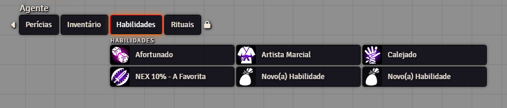

# Token Action HUD Ordem Paranormal

Token Action HUD é uma interface reposicionável que mostra as ações do token selecionado.

# Funcionalidades
- Utilize perícias, itens, habilidades e rituais sem ter que abrir a ficha.
- Mova a interface e escolha se ela irá se expandir para cima ou para baixo.
- Desbloqueie a interface e customize o layout e os grupos individualmente por ator.

# Instalação

## Método 1 - Pelo Foundry Manual
1. Na página principal do git clique na última versão (canto inferior direito)

2. Clique com o botão direito em module.json e selecione a opção **Copiar Link**

3. Vá para o Foundry e entre na tela de módulos e clique no botão de instalar módulos

4. Cole o link na caixa de texto inferior da janela de instalação e clique no botão de instalar

5. Aceite a instalação das dependências
6. Vá no seu mundo e habilite o Token Action HUD Ordem Paranormal, isso também irá habilitar os outros módulos necessários

7. Se divirta

# Dependências

## Token Action HUD Core
O módulo [Token Action HUD Core](https://foundryvtt.com/packages/token-action-hud-core).

## socketlib
Token Action HUD Core depende do módulo [socketlib](https://foundryvtt.com/packages/socketlib).

# Suporte
Para um guia de como utilizar o Token Action HUD, vá para: [Como utilizar Token Action HUD](https://github.com/Larkinabout/fvtt-token-action-hud-core/wiki/How-to-Use-Token-Action-HUD) (inglês)

Para perguntas, pedidos de funcionalidades ou avisos de bug, favor abrir um problema [aqui](https://github.com/TarcisMoreda/token-action-hud-ordem-paranormal/issues).

Pedidos de pull são bem vindos. Favor incluir o motivo do pedido ou crie um problema antes de fazer o pedido.

# Agradecimentos
Obrigado a natureza open source dos módulos por serem o exemplo de como fazer a implementação, especialmente o [Token Action HUD PF2E](https://github.com/Larkinabout/fvtt-token-action-hud-pf2e) e [Token Action HUD CoC7](https://gitlab.com/vtt2/token-action-hud-coc7)

# Licença
Esse módulo para o Foundry VTT está licenciado sob uma [Creative Commons Attribution 4.0 International License](https://creativecommons.org/licenses/by/4.0/) e seu trabalho está licenciado sob a [Foundry Virtual Tabletop EULA - Limited License Agreement for module development](https://foundryvtt.com/article/license/).
